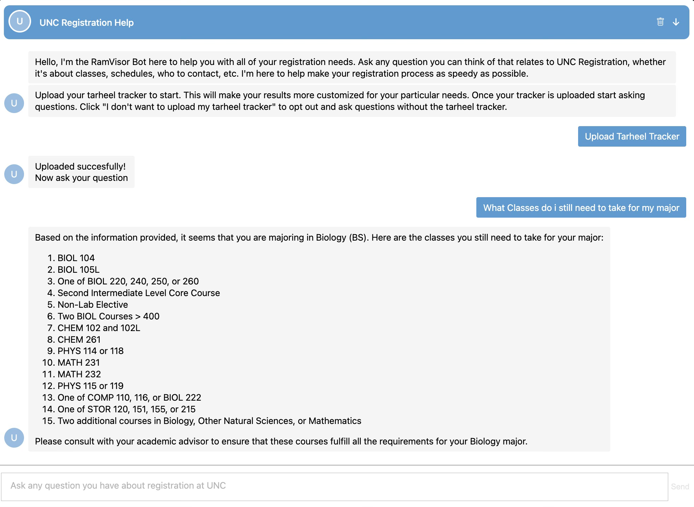

# RamVisor: AI Assistant for Course Registration

## Overview

RamVisor is an AI-powered assistant designed to answer any questions related to the University of North Carolina's course catalog and undergraduate registration. This project involved a full-stack approach, integrating advanced data engineering, artificial intelligence, and web technologies to create a seamless user experience for students seeking registration information.

The system was built using a combination of Flask, Python, Botpress, and REST APIs, enabling smooth communication between the frontend, backend, and AI logic. The result is a robust, user-friendly assistant that provides accurate and relevant responses without requiring users to create accounts.

## Key Features

### 1. Comprehensive Knowledge Base
RamVisor's knowledge base includes all relevant information about the UNC course catalog and registration processes for undergraduates. The data was meticulously structured into a complex JSON format, ensuring that all aspects of course registration were covered comprehensively.

### 2. Advanced Retrieval-Augmented Generation (RAG)
A custom Retrieval-Augmented Generation (RAG) solution was implemented to overcome a common challenge in cosine similarity searches, where extremely long strings are often missed even when they are highly relevant. To address this, the RAG was performed on carefully crafted descriptive data titles rather than the actual text, allowing for more accurate and relevant search results.

### 3. Intelligent Data Structuring and Retrieval
The project involved sophisticated data engineering to break down the information into logically grouped sections. Searches were conducted on the headings, with all related text under the heading retrieved along with it. This structure enabled the AI to effectively access and utilize the most relevant information to answer user queries.

### 4. Dynamic Search and Answer Mechanism
RamVisor includes a dynamic search mechanism where the AI assesses whether it has gathered enough information to answer the question. If not, it modifies the search term slightly and continues searching until it has enough data or determines that the database does not contain the required information. This iterative process ensures high accuracy and relevance in responses.

### 5. Full-Stack Integration
The project showcases a full-stack implementation, combining:

- **AI and Machine Learning**: Utilized the OpenAI Assistants API with detailed prompt engineering to guide the AI in understanding and responding to user queries.
- **Flask and Python**: Managed the backend logic and REST API communications.
- **Botpress**: Integrated Botpress for dialogue management and ensuring the AI responded correctly to user interactions.
- **REST APIs**: Facilitated communication between the frontend, Botpress, and the Flask-based backend.

### 6. User-Friendly Frontend
RamVisor features an intuitive frontend that interacts with the backend via REST APIs. The design prioritizes ease of use, allowing students to quickly find answers to their registration-related questions.

### 7. Account-Free Operation
The system was designed to operate without requiring users to create accounts. This was achieved through an innovative code structure that maintained user context and session information without the need for persistent user accounts.

## System Workflow

1. **User Interaction**: The user poses a question about course registration on the frontend.
2. **Query Processing**: The AI processes the query, using RAG to retrieve the most relevant information from the knowledge base.
3. **Iterative Search**: If the initial search does not provide sufficient information, the AI modifies the query and searches again.
4. **Response Generation**: Once the AI has enough information, it generates a natural language response.
5. **Frontend Display**: The response is sent back to the frontend and displayed to the user.

## Technology Stack

- **Flask**: For backend logic and API creation.
- **Python**: Core programming language used for AI logic and backend operations.
- **Botpress**: For managing dialogues and ensuring accurate responses.
- **REST APIs**: For seamless communication between frontend, Botpress, and backend services.
- **OpenAI Assistants API**: Used for advanced AI and natural language processing capabilities.

## Frontend Example

The image above shows the user interface of RamVisor, where students can easily interact with the AI assistant to get answers to their registration-related questions.

## Conclusion

RamVisor represents a powerful combination of AI, data engineering, and web technologies to create a highly effective registration assistant. Through intelligent data structuring, advanced retrieval techniques, and full-stack integration, RamVisor offers a seamless and user-friendly experience for students navigating the complex registration process at UNC.
